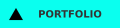

<p align="center">
  
</p>

<p align="center"><a href="https://mrhpn.com" target="_blannk"></a>
<a href="https://linkedin.com/in/mrhpn" target="_blannk"></a>
<a href="mailto:hello@mrhpn.com"></a></p>
<p align="center">  </p>

## ✨ About Me

```
const hpn = {
  name       : "Htet Phyo Naing",
  nickname   : "hp",
  role       : "Full-Stack Software Engineer",
  location   : "Myanmar 🇲🇲 — Building products for global users",
  obsessions : ["Performance", "Scalable systems", "OCD for clean code"],
  funFact    : "I care about the tiny details that make software feel fast and polished."
};
```

Enthusiastic and highly motivated Full-Stack Engineer with hands-on experience
in software engineering. Fast learner who adapts quickly to new technologies and
values hard work, clean code, and building reliable systems designed to last.

- 🔭 **Currently Working On**: A multi-tenant SaaS application for financial
  services and cash-out businesses in Myanmar.
- 🌱 **Learning**: Constantly refining my knowledge and exploring to DevOps
  field.
- 💬 **Ask me about**: Node.js, React, Next, ORM, and Database Schema Design
- ⚡ **Beyond Coding**: I enjoy reading and competitive mobile gaming.

## ♥️ Things I Live With

### 📝 Languages


### 🎨 Frontend


### ⚙️ Backend


### 💾 Databases & ORMs


### 🚀 DevOps

 
 
 


### 🚀 Others

 
 


## Let's Connect

portfolio: <a href="https://mrhpn.com" target="_blank">`https://mrhpn.com`</a> ↗
<br/> linkedin: <a href="https://linkedin.com/in/mrhpn" target="_blank">`mrhpn`
</a> ↗ <br/> telegram:
<a href="https://t.me/mrhpnn" target="_blank">`@mrhpnn`</a> ↗ <br/> email:
<a href="mailto:hello@mrhpn.com">`hello@mrhpn.com`</a> ↗
